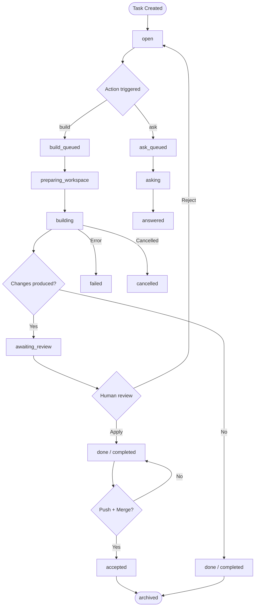

AgentSwarm is built around a small set of concepts that compose cleanly: a **task** describes the work, a **provider** runs it inside an isolated workspace, a **checkpoint** captures the result for human review, and higher-level constructs like **sequences**, **snippets**, **postflight**, and **repository automation** layer on top to support complex, repeatable workflows. This page explains each concept in detail.

## Concepts

<AccordionGroup>
  <Accordion title="Task" icon="list-check">
    A **task** is the primary unit of work in AgentSwarm. It pairs a prompt with a repository, a provider, and a branch strategy, then tracks everything that happens during execution: status transitions, agent messages, logs, runs, diffs, Git operations, and checkpoints.

    Tasks have two types:

    | Type | Behavior |
    |------|----------|
    | **Build** | The agent is asked to make code changes. Changes are captured in a checkpoint and must be reviewed before the task can proceed. |
    | **Ask** | The agent inspects the repository and returns an answer. No workspace changes are produced and no checkpoint is created. |

    Tasks can be created from several sources:

    - **Blank** — write a prompt from scratch
    - **Snippet** — start from a reusable prompt template with variables
    - **Sequence** — run a multi-step chain of prompts
    - **Issue** — import a GitHub issue as the prompt
    - **Pull Request** — import a GitHub pull request for review or build work

    Each task runs in its own isolated workspace under `task-workspaces/` and operates on a dedicated Git branch (either a new feature branch or an existing branch, depending on the branch strategy).
  </Accordion>

  <Accordion title="Task Status" icon="circle-half-stroke">
    Every task moves through a defined lifecycle. The full set of status values, as defined in `packages/shared-types`, is:

    | Status | Label | Meaning |
    |--------|-------|---------|
    | `scheduled` | Scheduled | Task is scheduled for a future start time. |
    | `build_queued` | Build Queued | A build action has been accepted and is waiting for a free agent slot. |
    | `preparing_workspace` | Preparing Workspace | The runtime is cloning or checking out the workspace. |
    | `building` | Building | The agent is actively executing the build prompt. |
    | `ask_queued` | Ask Queued | An ask action is queued (runs in parallel when capacity allows). |
    | `asking` | Answering | The agent is actively executing the ask prompt. |
    | `open` | Open | Task exists and is ready to be worked on. |
    | `in_progress` | In Progress | Task has been manually moved into active work. |
    | `in_review` | In Review | Task is under manual review. |
    | `awaiting_review` | Awaiting Review | Agent finished a build run and a checkpoint is pending human action. |
    | `done` | Done | Task work is complete and the checkpoint has been applied. |
    | `completed` | Completed | Build run finished successfully. |
    | `answered` | Answered | Ask run returned a response. |
    | `accepted` | Accepted | Changes were accepted and the task is resolved. |
    | `archived` | Archived | Terminal state — task is closed and no further actions are allowed. |
    | `cancelled` | Cancelled | Execution was cancelled before completing. |
    | `failed` | Failed | The agent run encountered an error. |

    The workflow view groups these into broader **workflow status** buckets: `backlog`, `ready`, `in_progress`, `review`, `done`, and `archived`. These map to the columns on the task board.
  </Accordion>

  <Accordion title="Provider" icon="robot">
    A **provider** is the AI engine used to execute a task. AgentSwarm supports two providers:

    | Provider | Value | Backend |
    |----------|-------|---------|
    | Codex | `codex` | OpenAI API |
    | Claude | `claude` | Anthropic API |

    Each provider runs in its own isolated Docker runtime image and has its own set of model options and effort profiles.

    #### Codex Models

    | Label | Model ID |
    |-------|----------|
    | GPT-5.4 | `gpt-5.4` |
    | o3 | `o3` |
    | o4-mini | `o4-mini` |
    | o3-mini | `o3-mini` |
    | GPT-4.1 | `gpt-4.1` |
    | GPT-4o | `gpt-4o` |

    Codex effort levels: `low` · `medium` · `high`

    #### Claude Models

    | Label | Model ID |
    |-------|----------|
    | Claude Opus 4 | `claude-opus-4-5` |
    | Claude Sonnet 4.5 | `claude-sonnet-4-5` |
    | Claude Sonnet 4 | `claude-sonnet-4` |
    | Claude Haiku 3.5 | `claude-haiku-3-5` |

    Claude effort levels: `low` · `medium` · `high` · `max`

    Claude effort profiles map to thinking budgets when the resolved model supports extended thinking. The `max` level leaves the budget unset. Codex natively supports low, medium, and high reasoning effort.

    Provider defaults (default model and default effort) are configured globally in **Settings** and can be overridden per task.
  </Accordion>

  <Accordion title="Checkpoint / Change Proposal" icon="flag">
    When a build task produces code changes, the agent runtime creates a **checkpoint** — a pending snapshot of those changes stored as a unified diff with file lists and statistics.

    The checkpoint represents a gate: the task enters `awaiting_review` status and no further build actions can be triggered until the checkpoint is resolved. Three resolution actions are available:

    | Action | Effect |
    |--------|--------|
    | **Apply** | Commits the proposed changes to the task workspace branch and marks the checkpoint resolved. |
    | **Reject** | Discards the proposed changes. The workspace is restored to the state before the build run. Only files that were newly created or modified by the agent are removed — pre-existing untracked files are preserved. |
    | **Revert** | Undoes a previously applied checkpoint by replaying the stored diff in reverse. |

    Checkpoint actions are blocked while a build or ask run is actively queued or in progress.

    A task's `hasPendingCheckpoint` flag is the authoritative indicator that a checkpoint is awaiting action.

    <Note>
      The terms **checkpoint** and **change proposal** refer to the same concept. The data model uses `TaskChangeProposal`; the UI and product documentation use "checkpoint" for the pending state and "change proposal" for the broader record.
    </Note>
  </Accordion>

  <Accordion title="Task Workspace" icon="folder-open">
    Every task operates inside its own isolated **task workspace** — a filesystem directory under `task-workspaces/` on the host. The workspace is a Git clone of the repository, checked out to the task's working branch.

    Key characteristics:

    - Workspaces are provisioned by the server spawner before the first run. Subsequent runs reuse the same workspace directory.
    - The agent runtime container mounts the workspace via Docker volume and makes all changes there.
    - Live diffs on the task detail page compare the workspace's current state against the base ref (e.g. `origin/main`).
    - An **interactive browser terminal** lets you open a shell directly in the workspace to inspect files, run commands, or make manual edits. Interactive sessions also produce change proposals when they detect workspace modifications.
    - Workspaces are runtime data. Do not commit the `task-workspaces/` directory.

    In Docker deployments, `TASK_WORKSPACE_HOST_ROOT` must be set to an absolute host path so that both the server container and the agent runtime containers can mount the same directory.
  </Accordion>

  <Accordion title="Snippet" icon="file-lines">
    A **snippet** is a reusable prompt template. Snippets support named **variables** with types (`text` or `multiline`), titles, descriptions, and default values. When a task is created from a snippet, the user fills in the variable values and the server renders the final prompt before execution.

    Snippets are useful for standardizing repetitive tasks across a team — for example, a "Write tests for this file" snippet with a `file_path` variable, or a "Summarize this PR" snippet with a `pr_description` variable.

    Snippets can also be embedded as steps in a **Sequence**.
  </Accordion>

  <Accordion title="Sequence" icon="arrow-right-arrow-left">
    A **sequence** is an ordered chain of prompt steps executed against the same task and repository. Each step can be an inline prompt or reference a saved snippet.

    Sequences have two execution modes:

    | Mode | Behavior |
    |------|----------|
    | `auto_apply_changes` | Checkpoints produced between steps are applied automatically. Execution continues to the next step without human intervention. |
    | `approve_before_continuing` | Execution pauses after each step that produces a checkpoint. A human must approve (apply the checkpoint) before the sequence advances. |

    A sequence run tracks the state of each step (`pending`, `running`, `succeeded`, `failed`, `skipped`) and the overall run status (`running`, `waiting_for_approval`, `waiting_for_checkpoint_resolution`, `succeeded`, `failed`).

    Sequences support variables that are passed through to each step's prompt rendering, enabling parameterized multi-step workflows.
  </Accordion>

  <Accordion title="Postflight" icon="flag-checkered">
    **Postflight** is optional repository-level automation that runs after a successful build task and before the final checkpoint is created. It is defined in `.agentswarm/postflight.yml` in the repository root.

    Postflight runs in a separate Docker container with the task workspace mounted. You can use it to run tests, generate screenshots, lint code, or perform any other validation that should happen before a human reviews the checkpoint.

    A minimal postflight configuration looks like this:

    ```yaml
    version: 1
    enabled: true

    when:
      task_types: ["build"]
      providers: ["codex", "claude"]

    runner:
      image: "mcr.microsoft.com/playwright:v1.52.0-jammy"
      timeout_seconds: 1800

    steps:
      - run: "npm ci"
      - run: "npx playwright test tests/mobile-screenshots.spec.ts --project=mobile-web --update-snapshots"

    on_failure: "fail_task"
    ```

    Setting `on_failure: fail_task` causes the task to enter `failed` status if any postflight step exits with a non-zero code, preventing a checkpoint from being surfaced for review when the build is known to be broken.
  </Accordion>

  <Accordion title="Repository Automation" icon="gears">
    **Repository automation** lets AgentSwarm create tasks automatically from GitHub webhook events. Each repository can have one or more automation rules that match incoming events and produce tasks according to a configured task template.

    Supported trigger types:

    | Trigger | Event |
    |---------|-------|
    | `issue_opened` | A new GitHub issue is opened. |
    | `pull_request_opened` | A new pull request is opened. |
    | Comment / reaction triggers | A comment or reaction on an issue or PR when comment automation is enabled on the rule. |

    Rules support **label filters** (`labelsAny`, `labelsAll`, `labelsNone`) to restrict which issues or PRs trigger task creation. You can also restrict which GitHub actor logins are allowed to trigger automation.

    Example rule:

    ```json
    {
      "id": "ai-issue-opened",
      "name": "AI issue to build task",
      "enabled": true,
      "trigger": "issue_opened",
      "syncStatusEnabled": true,
      "labelFilter": {
        "labelsAny": ["ai"],
        "labelsNone": ["wip"]
      },
      "task": {
        "assigneeEmail": "dev@example.com",
        "taskType": "build",
        "provider": "codex",
        "providerProfile": "high",
        "modelOverride": "gpt-5.4",
        "codexCredentialSource": "profile"
      }
    }
    ```

    Configure the webhook URL in GitHub under **Repository Settings → Webhooks**:

    ```text
    https://<your-host>/api/webhooks/github/<repositoryId>
    ```

    Use content type `application/json` and subscribe to the events you want to automate (Issues, Pull requests, Pull request review comments, Issue comments, Reactions).
  </Accordion>

  <Accordion title="MCP Servers" icon="plug">
    **Model Context Protocol (MCP) servers** extend agent capabilities by exposing additional tools and data sources to the agent at runtime. MCP servers are configured globally in **Settings** and are made available to all agent runs.

    AgentSwarm supports two MCP transport types:

    | Transport | Description |
    |-----------|-------------|
    | `stdio` | The MCP server is launched as a subprocess inside the agent runtime container. Specify a `command` and optional `args`. |
    | `http` | The MCP server is a remote HTTP endpoint. Specify a `url` and optionally a `bearerTokenEnvVar` for authentication. |

    Each MCP server configuration has a `name`, an `enabled` flag, a `transport`, and transport-specific fields. Disabling a server removes it from the agent's tool list without deleting the configuration.
  </Accordion>
</AccordionGroup>

## Task Lifecycle

The diagram below shows how a build task moves through its key lifecycle states from creation to completion.



<Tip>
  The `ask` flow can run in parallel with an active build on the same task when agent capacity allows. This makes it possible to ask the agent questions about the codebase while a build is in progress.
</Tip>

## Next Steps

<CardGroup cols={2}>
  <Card title="Tasks" icon="list-check" href="/features/tasks">
    Learn how to create tasks, configure branch strategies, attach files to prompts, and use the interactive terminal.
  </Card>
  <Card title="Sequences" icon="arrow-right-arrow-left" href="/features/sequences">
    Build multi-step agent workflows with auto-apply or human-gated execution modes.
  </Card>
</CardGroup>
